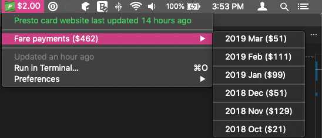

# PRESTO card balance BitBar plugin

Are you working tirelessly away at your Mac, just about the pack up and head home, but have no idea what your PRESTO balance is?

Or maybe you just want to see how much you've been spending per month.

Well now you can! (well, assuming the website is up to date...)




Supports loading balance of your current card only.

# Setup

## Install BitBar

https://getbitbar.com/

## Install package

Download the repository and then run:

```bash
$ npm install
$ npm install -g ./prestobitbar/
```

## Configure plugin

Edit and save config.dist.json as config.json.

## Add to bitbar

```bash
$ cd path/to/your/bitbar/plugins/directory

# create a symlink to the plugin
# instead of 2h, use whatever frequency you desire
$ ln -s $(which presto-card-bitbar) prestobitbar.2h.js
```
